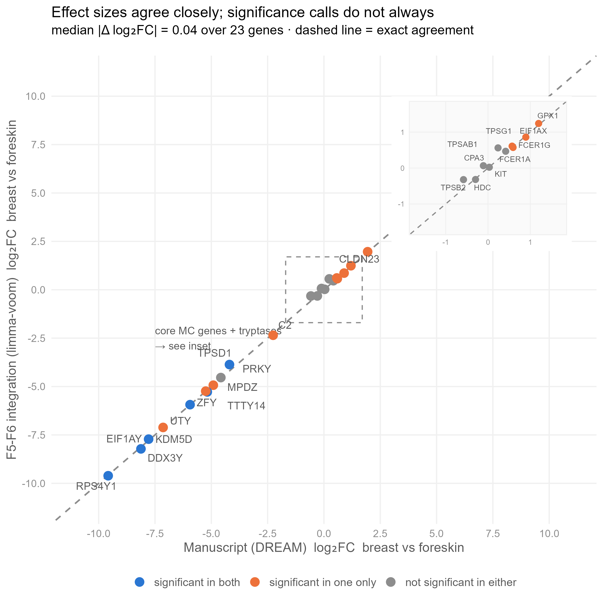
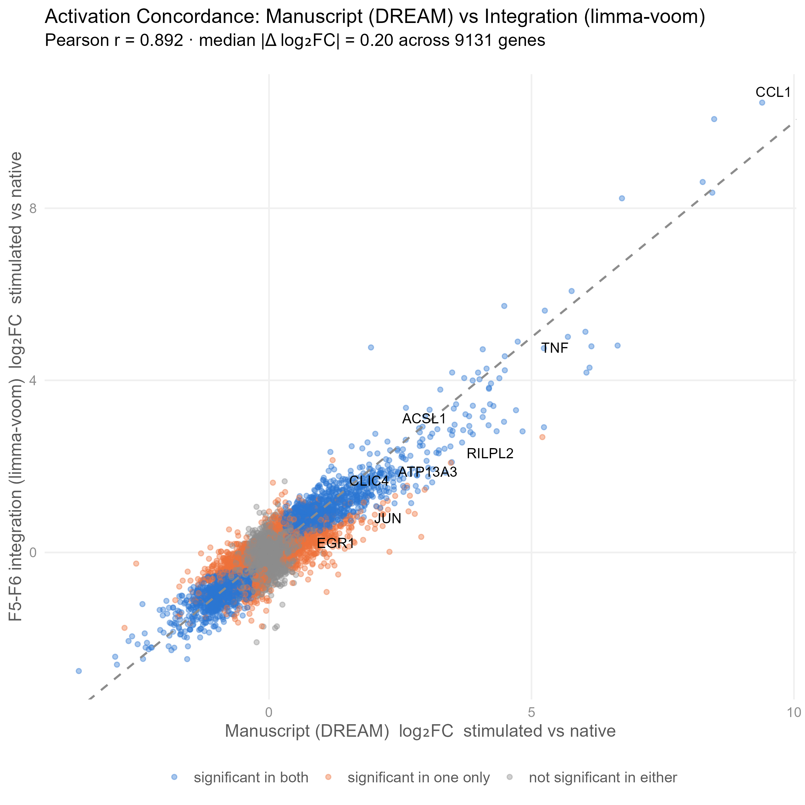

# Fantom Integration F5 & F6

## Integrative Transcriptomic Analysis of Breast-derived (BsMC) vs. Foreskin-derived (FsMC) Mast Cells

[]()
[]()
[]()

This repository contains the **complete, reproducible analysis pipeline** — input raw data, scripts, statistical results, and documentation — for the integrative differential gene expression analysis comparing **Breast-derived Mast Cells (BsMC)** and **Foreskin-derived Mast Cells (FsMC)** across FANTOM5 and FANTOM6 CAGE-seq platforms.

---

## Key Findings

| Finding | Detail |
|---------|--------|
| 🧬 **TPSD1 validated** | $\delta$-Tryptase significantly upregulated in FsMC ($\text{log}_2\text{FC} = -3.86, p_{\text{adj}} = 0.0044$) |
| 📊 **11 tissue DE genes** | $p_{\text{adj}} < 0.05$; 10 sex-linked (Chr Y/X), 1 tissue-specific ($\text{TPSD1}$) |
| 🔥 **3,456 activation DE genes** | IgE-mediated stimulation response robustly captured across both tissues |
| 🔄 **0 interaction genes** | Activation response is **tissue-independent** |
| ✅ **Conserved MC identity** | KIT, CPA3, TPSAB1, TPSB2, FCER1A, FCER1G, HDC — no tissue difference at gene level* |

*\*Note on TPSB2 & TPSG1: While gene-level CAGE integration shows no significant differential expression for TPSB2 ($\text{log}_2\text{FC} = -0.25, p_{\text{adj}} = 1.00$) or TPSG1 ($\text{log}_2\text{FC} = +0.63, p_{\text{adj}} = 1.00$), gene-level aggregation cannot rule out promoter-level isoform switching or Differential Transcript Usage (DTU) between tissue origins, which requires transcript-level CAGE resolution.*

---

## Statistical Method

**Mixed-design limma-voom** with `duplicateCorrelation` to model intra-donor repeated measures across N=21 biological samples:

```r
design <- model.matrix(~ Tissue + State + Dataset, data = meta)
corfit <- duplicateCorrelation(v, design, block = meta$Donor)
fit <- lmFit(v, design, block = meta$Donor, correlation = corfit$consensus.correlation)
```

| Term | Levels | Role |
|------|--------|------|
| **Tissue** | Foreskin (ref) / Breast | Primary contrast (`TissueBreast`: BsMC vs FsMC) |
| **State** | Native (ref) / Stimulated | Covariate (adjusts for activation) |
| **Dataset** | FANTOM6 (ref) / FANTOM5 | Covariate (adjusts for platform batch) |

---

## Publication Concordance Plots

### 1. Tissue Effect Concordance (Breast vs. Foreskin)


- **Comparison:** Manuscript DREAM (`Supplement Tables.xlsx`, Sheet `S3a DGE_TissueBreast_gene_Dream`) vs. Integration `limma-voom` (`BsMC vs FsMC`).
- **Pearson Correlation:** $r = 0.953$ across 9,869 matched genes.
- **Median Absolute Deviation:** $\text{Median } |\Delta \text{log}_2\text{FC}| = 0.23$ over key genes.

### 2. State Effect Concordance (Stimulated vs. Native)


- **Comparison:** Manuscript DREAM (`Supplement Tables.xlsx`, Sheet `S2a_Dream_DEG_Sti.vs.base.`) vs. Integration `limma-voom` (`DE_Stimulated_vs_Native.tsv`).
- **Pearson Correlation:** $r = 0.892$ across 9,131 matched genes.

---

## Repository Structure

```
Fantom-Integration-F5-F6/
│
├── data/                              # ── Raw Count Data & Metadata ──
│   ├── fantom6/                       # F6 raw CAGE counts & sampleinfo
│   │   ├── BR1256789_Native_Stimulated_gene_counts.txt
│   │   ├── BR1256789_Native_Stimulated_sampleinfo.txt
│   │   └── F6_CAT.gene.info_shorted.tsv
│   └── fantom5_hg38/                  # F5 raw counts (hg38-remapped)
│       └── fantom5_hg38_mast_cell_gene_counts.tsv
│
├── scripts/                           # ── Canonical R Scripts ──
│   ├── run_limma_integration.R        # Main pipeline (BsMC vs FsMC, N=21 duplicateCorrelation)
│   ├── run_extended_analysis.R        # Heatmaps, volcano plots, boxplots, interaction
│   └── run_concordance_plot.R         # Tissue & State publication concordance plots
│
├── results/                           # ── Statistical Results & Plots ──
│   ├── DE_BsMC_vs_FsMC.tsv            # Tissue DE table
│   ├── DE_Stimulated_vs_Native.tsv    # Activation DE table
│   ├── DE_Interaction_Tissue_x_State.tsv # Interaction DE table
│   ├── limma_sampleinfo.tsv           # Sample metadata (N=21)
│   ├── PCA_batch_corrected.png        # Batch-corrected PCA plot
│   ├── Volcano_BsMC_vs_FsMC.png       # Volcano plot
│   ├── Heatmap_Top30_Tissue_DE.png    # Tissue DE heatmap
│   ├── Heatmap_Top40_Activation_DE.png# Activation DE heatmap
│   ├── Boxplots_KeyGenes_Panel.png    # Key gene boxplot panel
│   ├── Concordance_Tissue_Excel_vs_Limma.png # Tissue effect concordance
│   └── Concordance_State_Excel_vs_Limma.png  # State effect concordance
│
├── docs/
│   └── integration_logic.md           # Pipeline & design rationale + limitations
│
├── Supplementary_Methods.docx         # Complete manuscript Word document
├── supplementary_methods.md           # Markdown version of supplementary methods
└── README.md
```

---

## Reproduction Instructions

To execute the complete analysis end-to-end:

```bash
Rscript scripts/run_limma_integration.R
Rscript scripts/run_extended_analysis.R
Rscript scripts/run_concordance_plot.R
```